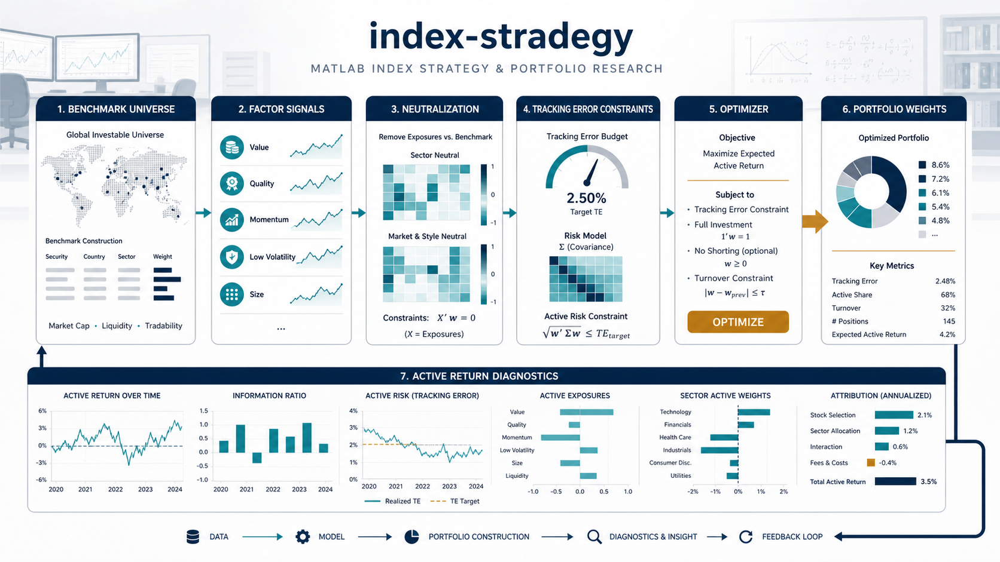

# Index Strategy

    

  <strong>MATLAB index-enhancement workflow with neutralization, optimization, and simulation steps.</strong>

  

The overview figure connects benchmark construction, factor signals, neutralization, tracking-error control, optimization, and active-return diagnostics into one MATLAB workflow.

## Overview

Index Strategy provides a step-by-step MATLAB workflow for index enhancement research. The scripts move from neutralization tests to portfolio enhancement, simulation, and batch evaluation, making the research path easy to rerun and audit.

## What Is Included

- `step1_neutral_test.m`: factor neutralization test.
- `step2_enhance_demo.m`, `step2_enhance_test.m`: index-enhancement demos and tests.
- `step3_simulate_test.m`: single simulation test.
- `step4_simulate_batch.m`: batch simulation runner.
- `utils/`: shared MATLAB utilities.

## Quick Start

1. `git clone git@github.com:Hik289/index-stradegy.git`
2. Open MATLAB and add the repository root plus `utils/` to the path.
3. Run `step1_neutral_test.m` first, then proceed through the numbered scripts.

## Suggested Workflow

1. Start with the smallest runnable script or notebook listed above.
2. Keep raw data paths and credentials outside the repository.
3. Save generated figures, tables, and reports under the existing result folders.
4. When an experiment becomes stable, record the exact data window, parameters, and command used to reproduce it.

## Repository Map

- `assets/readme-figure.png`: README overview figure.
- Project scripts and notebooks: core research entry points.
- Result or report folders: generated artifacts used for analysis and review.

## Paper or Reference

No external paper link is currently attached to this project. For now, the code, notebooks, and notes in this repository are the primary reference artifact.

## License

No explicit license file is included yet. Add one before public reuse, redistribution, or package release.

## Maintenance Notes

- Add a pinned environment file if this project is prepared for external installation.
- Keep large datasets outside Git and document where each script expects them locally.
- Prefer small, named experiment outputs over overwriting shared result files.
